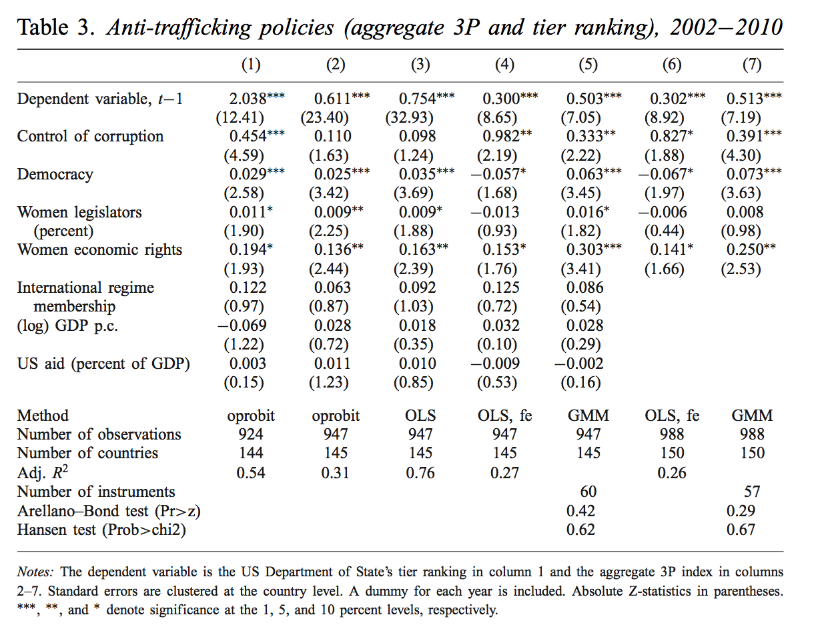
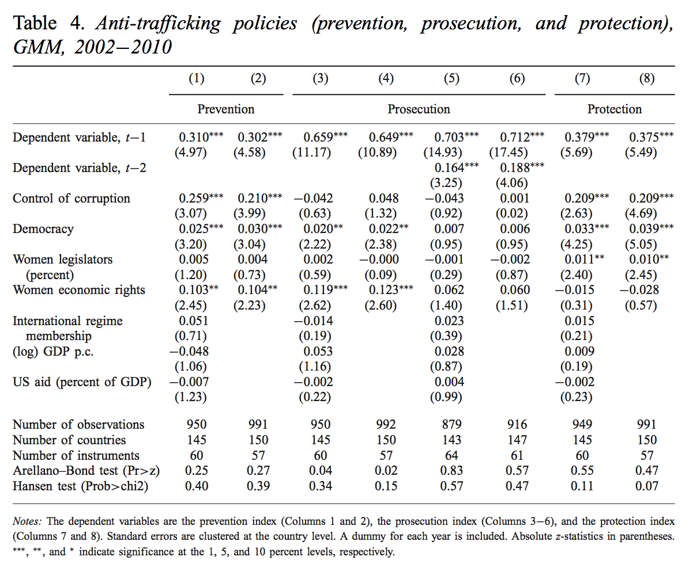

```{r setup, include=FALSE}
knitr::opts_chunk$set(echo = TRUE)
```

---

## Original models

Replication of Seo-Young Cho, Axel Dreher, and Eric Neumayer. 2014. "Determinants of Anti-Trafficking Policies: Evidence from a New Index." *The Scandinavian Journal of Economics* 116, no. 2 (April): 429–54. doi: [10.1111/sjoe.12055](https://dx.doi.org/10.1111/sjoe.12055).

### Model details

- DV = 3P variables
- Pooled time-series cross-section (panel) data from 2002–2010 (but 2010 is excluded, according to footnote 20)
- Robust standard errors clustered at country level
- Temporal lag of dependent variable
- Country and year fixed effects
- Ordered probit, OLS, and system GMM models
- Variables:
    - Control of corruption (Kaufmann 2009), ranges from -1.63 (high corruption) to 2.58 (low corruption)
    - Lagged Polity
    - Women legislators (percent) - World Bank Gender Statistics database
    - Women economic rights - CIRI
    - International regime membership - binary indicator for Palermo protocol ratification
    - Log GDP/capita - World Bank, presumably
    - US aid as % of GDP - somewhere

### Table 3: Anti-trafficking policies in aggregate

(*Uses ordered probit, OLS, and GMM*)



### Table 4: Anti-trafficking policy components

(*Uses only GMM*)



---

## Replication

```{r load-libraries, message=FALSE}
library(tidyverse)
```

